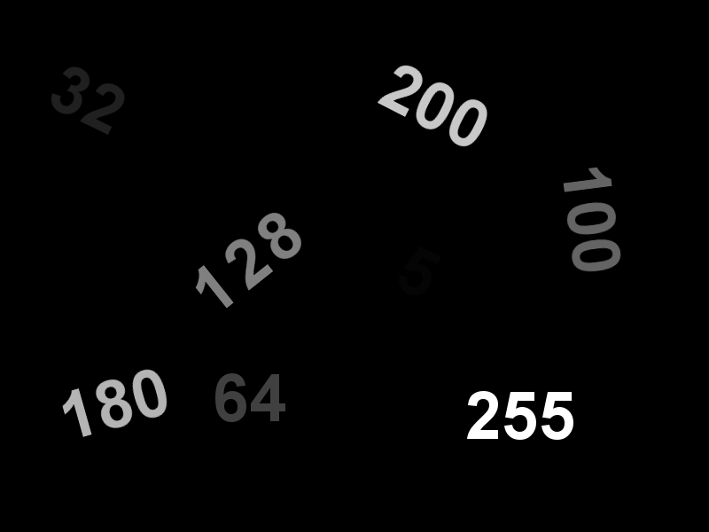
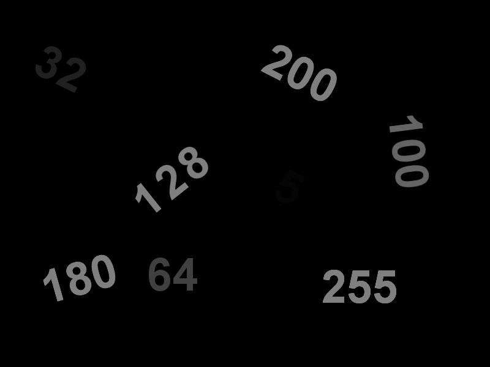
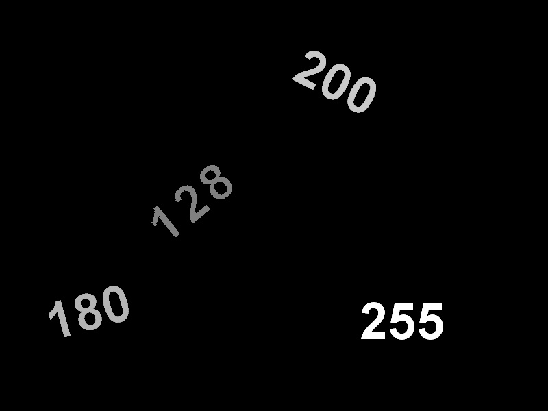
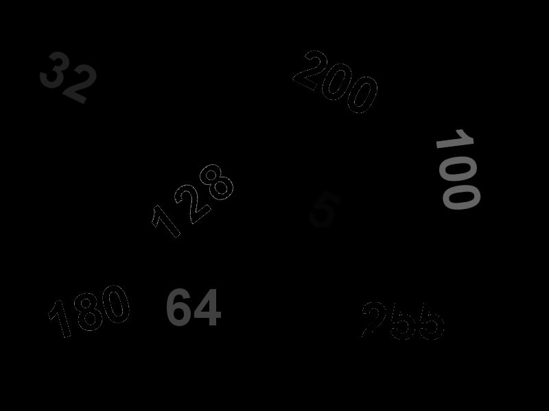
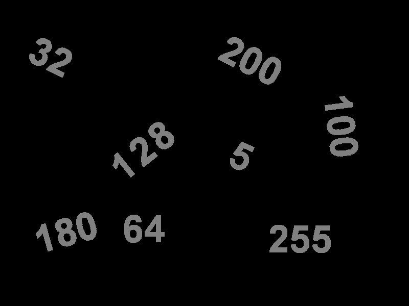
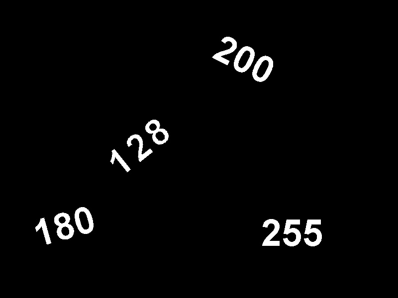
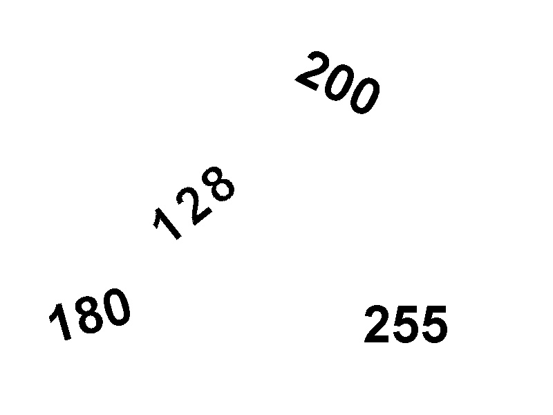

# OpenCV Training Image Thresholding
Global/Binary/Inverse Binary/Truncate/Threshold to Zero/Inverted Threshold Image using OpenCV.

These are the types covered in this repository:

+ Global Thresholding
+ Binary Thresholding
+ Inverse-Binary Thresholding
+ Truncate Thresholding
+ Threshold to Zero
+ Inverted Threshold to Zero

## Contents :
Thresholding therefore has numerous applications in computer vision, and is often performed in the initial stages in  many processing pipelines. There are several types of thresholding algorithms.

| Function        |Action                                                                        |
|----------------:|------------------------------------------------------------------------------|
|cv2.threshold()   |We apply the threshold.|
|**cv2.THRESH_BINARY** | Binary Thresholding|
|**cv2.THRESH_BINARY_INV**| Inverse-Binary Thresholding|
|**cv2.THRESH_TRUNC**       |Truncate Thresholding|
|**cv2.THRESH_TOZERO** | Threshold to Zero|
|**cv2.THRESH_TOZERO_INV**|Inverted Threshold to Zero|

## Test Image used: 
I have used threshold.png that can be found in the repository.










## Summary:

```python
# Basic threhold example 
th, dst = cv2.threshold(src, 0, 255, cv2.THRESH_BINARY); 
cv2.imwrite("opencv-threshold-example.jpg", dst); 
```
```python
# Thresholding with maxValue set to 128
th, dst = cv2.threshold(src, 0, 128, cv2.THRESH_BINARY); 
cv2.imwrite("opencv-thresh-binary-maxval.jpg", dst); 
```
```python
# Thresholding with threshold value set 127 
th, dst = cv2.threshold(src,127,255, cv2.THRESH_BINARY); 
cv2.imwrite("opencv-thresh-binary.jpg", dst); 
```
```python
# Thresholding using THRESH_BINARY_INV 
th, dst = cv2.threshold(src,127,255, cv2.THRESH_BINARY_INV); 
cv2.imwrite("opencv-thresh-binary-inv.jpg", dst); 
```
```python
# Thresholding using THRESH_TRUNC 
th, dst = cv2.threshold(src,127,255, cv2.THRESH_TRUNC); 
cv2.imwrite("opencv-thresh-trunc.jpg", dst); 
```
```python
# Thresholding using THRESH_TOZERO 
th, dst = cv2.threshold(src,127,255, cv2.THRESH_TOZERO); 
cv2.imwrite("opencv-thresh-tozero.jpg", dst); 
```
```python
# Thresholding using THRESH_TOZERO_INV 
th, dst = cv2.threshold(src,127,255, cv2.THRESH_TOZERO_INV); 
cv2.imwrite("opencv-thresh-to-zero-inv.jpg", dst);
```


